# 🏗️ Social Network Graph Analysis - System Architecture & Design

This project is a **comprehensive Social Network Graph Analysis** system built with **Java** and **Spring Boot**, featuring advanced graph algorithms, modern web UI, and scalable architecture. It demonstrates production-ready software engineering practices, algorithmic expertise, and full-stack development capabilities.

---

## 🏗️ System Architecture Overview

### Complete System Architecture
```mermaid
graph TB
    %% Frontend Layer
    subgraph "Frontend Layer (Client-Side)"
        subgraph "UI Components"
            HTML[HTML5 Structure<br/>- Split Panes Layout<br/>- Responsive Design<br/>- Theme System]
            CSS[CSS3 Styling<br/>- CSS Variables<br/>- Grid/Flexbox<br/>- Dark/Light Themes]
            JS[JavaScript ES6+<br/>- Event Handling<br/>- API Communication<br/>- State Management]
        end
        
        subgraph "Visualization Engine"
            D3[D3.js v7<br/>- Interactive Graph<br/>- Force Simulation<br/>- SVG Rendering<br/>- Zoom/Pan/Drag]
        end
        
        subgraph "API Client"
            API_CLIENT[SocialNetworkAPI Class<br/>- Fetch API Wrapper<br/>- Error Handling<br/>- JSON Processing]
        end
    end

    %% Backend Layer
    subgraph "Backend Layer (Spring Boot)"
        subgraph "Web Layer"
            CONTROLLER[SocialNetworkController<br/>@RestController<br/>- 12 REST Endpoints<br/>- Request Validation<br/>- Response Formatting]
        end
        
        subgraph "Service Layer"
            SN_SERVICE[SocialNetwork Service<br/>- Core Business Logic<br/>- Graph Operations<br/>- Algorithm Orchestration]
            DSU_SERVICE[DSU Service<br/>- Community Detection<br/>- Union-Find Operations<br/>- Path Compression]
        end
        
        subgraph "Model Layer"
            USER_MODEL[User Model<br/>- User Properties<br/>- Friendship Management<br/>- Weight Handling]
        end
    end

    %% Data Layer
    subgraph "Data Layer (In-Memory)"
        subgraph "Graph Representation"
            ADJACENCY[Adjacency List<br/>HashMap&lt;String, User&gt;<br/>- O(1) User Lookup<br/>- O(degree) Neighbor Access]
            WEIGHTS[Weighted Edges<br/>Map&lt;String, Integer&gt;<br/>- Friendship Strengths<br/>- Path Optimization]
        end
        
        subgraph "Algorithm Data Structures"
            PRIORITY_Q[Priority Queue<br/>- Dijkstra's Algorithm<br/>- Path Finding<br/>- O(log V) Operations]
            HASH_MAPS[HashMaps/HashSets<br/>- Visited Tracking<br/>- Distance Storage<br/>- Parent Pointers]
        end
    end

    %% Algorithm Layer
    subgraph "Algorithm Layer"
        subgraph "Path Finding Algorithms"
            BFS[BFS Shortest Path<br/>Time: O(V + E)<br/>Space: O(V)<br/>- Minimum Hops]
            DIJKSTRA_STRONG[Modified Dijkstra<br/>Time: O((V+E)logV)<br/>- Strongest Path<br/>- Cost = 1/weight]
            DIJKSTRA_WEAK[Modified Dijkstra<br/>Time: O((V+E)logV)<br/>- Weakest Path<br/>- Cost = weight]
        end
        
        subgraph "Centrality Algorithms"
            PAGERANK[PageRank Algorithm<br/>Time: O(k×(V+E))<br/>- Iterative Computation<br/>- Convergence Detection]
            DEGREE[Degree Centrality<br/>Time: O(1)<br/>- Direct Connections<br/>- Simple Count]
            CLOSENESS[Closeness Centrality<br/>Time: O(V×(V+E))<br/>- Average Distance<br/>- Global Reachability]
        end
        
        subgraph "Community Detection"
            DSU_ALGO[Disjoint Set Union<br/>Time: O(α(n))<br/>- Path Compression<br/>- Union by Rank]
        end
        
        subgraph "Network Analysis"
            CLUSTERING[Clustering Coefficient<br/>Time: O(degree²)<br/>- Local Connectivity<br/>- Triangle Counting]
            DENSITY[Network Density<br/>Time: O(V)<br/>- Edge/Node Ratio<br/>- Graph Connectivity]
        end
    end

    %% API Endpoints
    subgraph "REST API Endpoints"
        subgraph "User Management"
            EP1[GET /api/users<br/>- List All Users]
            EP2[POST /api/users<br/>- Add New User]
            EP3[GET /api/users/{id}/stats<br/>- User Statistics]
            EP4[GET /api/users/{id}/suggestions<br/>- Friend Suggestions]
        end
        
        subgraph "Network Operations"
            EP5[POST /api/friendships<br/>- Create Friendship]
            EP6[GET /api/graph<br/>- Graph Data Export]
            EP7[GET /api/stats<br/>- Network Statistics]
        end
        
        subgraph "Analysis Features"
            EP8[GET /api/path/{u1}/{u2}<br/>- Path Finding]
            EP9[GET /api/communities<br/>- Community Detection]
            EP10[GET /api/mutual/{u1}/{u2}<br/>- Mutual Friends]
            EP11[GET /api/influence/{k}<br/>- Top Influencers]
            EP12[GET /api/triangles<br/>- Triangle Count]
        end
    end

    %% Data Flow Connections
    HTML --> JS
    CSS --> JS
    JS --> API_CLIENT
    D3 --> JS
    
    API_CLIENT -.->|HTTP Requests| CONTROLLER
    CONTROLLER --> SN_SERVICE
    CONTROLLER --> DSU_SERVICE
    SN_SERVICE --> USER_MODEL
    DSU_SERVICE --> USER_MODEL
    
    SN_SERVICE --> ADJACENCY
    SN_SERVICE --> WEIGHTS
    SN_SERVICE --> BFS
    SN_SERVICE --> DIJKSTRA_STRONG
    SN_SERVICE --> DIJKSTRA_WEAK
    SN_SERVICE --> PAGERANK
    SN_SERVICE --> DEGREE
    SN_SERVICE --> CLOSENESS
    SN_SERVICE --> CLUSTERING
    SN_SERVICE --> DENSITY
    
    DSU_SERVICE --> DSU_ALGO
    
    BFS --> HASH_MAPS
    DIJKSTRA_STRONG --> PRIORITY_Q
    DIJKSTRA_WEAK --> PRIORITY_Q
    PAGERANK --> HASH_MAPS
    
    CONTROLLER -.->|JSON Response| API_CLIENT
    
    %% API Endpoint Connections
    EP1 --> SN_SERVICE
    EP2 --> SN_SERVICE
    EP3 --> SN_SERVICE
    EP4 --> SN_SERVICE
    EP5 --> SN_SERVICE
    EP6 --> SN_SERVICE
    EP7 --> SN_SERVICE
    EP8 --> SN_SERVICE
    EP9 --> DSU_SERVICE
    EP10 --> SN_SERVICE
    EP11 --> SN_SERVICE
    EP12 --> SN_SERVICE

    %% Styling
    classDef frontend fill:#e1f5fe,stroke:#01579b,stroke-width:2px
    classDef backend fill:#f3e5f5,stroke:#4a148c,stroke-width:2px
    classDef data fill:#e8f5e8,stroke:#1b5e20,stroke-width:2px
    classDef algorithm fill:#fff3e0,stroke:#e65100,stroke-width:2px
    classDef api fill:#fce4ec,stroke:#880e4f,stroke-width:2px
    
    class HTML,CSS,JS,D3,API_CLIENT frontend
    class CONTROLLER,SN_SERVICE,DSU_SERVICE,USER_MODEL backend
    class ADJACENCY,WEIGHTS,PRIORITY_Q,HASH_MAPS data
    class BFS,DIJKSTRA_STRONG,DIJKSTRA_WEAK,PAGERANK,DEGREE,CLOSENESS,DSU_ALGO,CLUSTERING,DENSITY algorithm
    class EP1,EP2,EP3,EP4,EP5,EP6,EP7,EP8,EP9,EP10,EP11,EP12 api
```

### Data Flow & Request Processing

```mermaid
sequenceDiagram
    participant User as 👤 User
    participant UI as 🖥️ Frontend UI
    participant API as 🔌 API Client
    participant Controller as 🎛️ REST Controller
    participant Service as ⚙️ Service Layer
    participant Model as 📊 Data Model
    participant Algo as 🧮 Algorithms

    Note over User,Algo: User Interaction Flow

    %% Add User Flow
    User->>UI: Add User "Alice"
    UI->>API: POST /api/users {"name": "Alice"}
    API->>Controller: HTTP POST Request
    Controller->>Service: addUser("Alice")
    Service->>Model: new User("Alice")
    Model-->>Service: User Object Created
    Service->>Service: users.put("Alice", user)
    Service-->>Controller: Success Response
    Controller-->>API: JSON {"status": "success"}
    API-->>UI: User Added Successfully
    UI-->>User: Toast Notification + UI Update

    %% Path Finding Flow
    User->>UI: Find Shortest Path Alice → Eve
    UI->>API: GET /api/path/Alice/Eve?type=shortest
    API->>Controller: HTTP GET Request
    Controller->>Service: shortestPath("Alice", "Eve")
    Service->>Algo: BFS Algorithm
    Algo->>Model: Access adjacency lists
    Model-->>Algo: Friend connections
    Algo-->>Service: Path: [Alice, Bob, David, Eve]
    Service-->>Controller: Path Result
    Controller-->>API: JSON {"path": [...], "found": true}
    API-->>UI: Path Data
    UI-->>User: Highlighted Path on Graph

    %% Network Statistics Flow
    User->>UI: View Network Statistics
    UI->>API: GET /api/stats
    API->>Controller: HTTP GET Request
    Controller->>Service: getNetworkStats()
    
    par Parallel Algorithm Execution
        Service->>Algo: computePageRank()
        Service->>Algo: getNetworkDensity()
        Service->>Algo: getAverageClusteringCoefficient()
        Service->>Service: getNumberOfCommunities()
    end
    
    Algo-->>Service: Algorithm Results
    Service-->>Controller: Comprehensive Stats
    Controller-->>API: JSON Statistics Object
    API-->>UI: Statistics Data
    UI-->>User: Real-time Dashboard Update
```


### Deployment & Layered Architecture
```mermaid
graph TB
    %% Client Environment
    subgraph "Client Environment"
        subgraph "Web Browser"
            BROWSER[Modern Web Browser<br/>Chrome 90+ / Firefox 88+<br/>Safari 14+ / Edge 90+]
            
            subgraph "Browser Runtime"
                JS_ENGINE[JavaScript Engine<br/>- V8 / SpiderMonkey<br/>- ES6+ Support<br/>- Fetch API]
                RENDER_ENGINE[Rendering Engine<br/>- HTML5 Parser<br/>- CSS3 Engine<br/>- SVG Support]
                DOM[Document Object Model<br/>- DOM Manipulation<br/>- Event Handling<br/>- Real-time Updates]
            end
        end
    end

    %% Server Environment
    subgraph "Server Environment (localhost:8080)"
        subgraph "JVM Runtime"
            JVM[Java Virtual Machine<br/>Java 11 Runtime<br/>- Garbage Collection<br/>- Memory Management<br/>- Thread Management]
            
            subgraph "Spring Boot Application"
                SPRING_CONTEXT[Spring Application Context<br/>- Dependency Injection<br/>- Bean Management<br/>- Auto Configuration]
                
                subgraph "Embedded Tomcat Server"
                    SERVLET_CONTAINER[Servlet Container<br/>- HTTP Request Processing<br/>- Session Management<br/>- Thread Pool]
                    STATIC_HANDLER[Static Resource Handler<br/>- /static/** mapping<br/>- Cache Headers<br/>- MIME Type Detection]
                end
            end
        end
        
        subgraph "Application Layers"
            subgraph "Presentation Layer"
                REST_ENDPOINTS[REST Controllers<br/>@RestController<br/>- Request Mapping<br/>- Response Serialization<br/>- Exception Handling]
            end
            
            subgraph "Business Logic Layer"
                SERVICES[Service Components<br/>@Service<br/>- Business Rules<br/>- Transaction Management<br/>- Algorithm Orchestration]
            end
            
            subgraph "Data Access Layer"
                REPOSITORIES[Data Access<br/>- In-Memory Storage<br/>- HashMap Operations<br/>- Data Consistency]
            end
        end
    end

    %% Performance Characteristics
    subgraph "Performance Characteristics"
        subgraph "Scalability Metrics"
            SMALL_NETWORK[Small Networks<br/>< 50 users<br/>Response: < 10ms<br/>Memory: < 50MB]
            MEDIUM_NETWORK[Medium Networks<br/>< 500 users<br/>Response: < 100ms<br/>Memory: < 200MB]
            LARGE_NETWORK[Large Networks<br/>< 5000 users<br/>Response: < 1s<br/>Memory: < 1GB]
        end
        
        subgraph "Algorithm Complexity"
            BFS_PERF[BFS: O(V + E)<br/>Shortest Path<br/>Linear Time<br/>Optimal for Unweighted]
            DIJKSTRA_PERF[Dijkstra: O((V+E)logV)<br/>Weighted Paths<br/>Priority Queue<br/>Optimal for Weighted]
            PAGERANK_PERF[PageRank: O(k×(V+E))<br/>Iterative Convergence<br/>k ≈ 10-50 iterations<br/>Parallel Potential]
            DSU_PERF[DSU: O(α(n))<br/>Nearly Constant<br/>Path Compression<br/>Union by Rank]
        end
    end

    %% Connection Flow
    BROWSER --> SERVLET_CONTAINER
    SERVLET_CONTAINER --> REST_ENDPOINTS
    REST_ENDPOINTS --> SERVICES
    SERVICES --> REPOSITORIES
    
    JS_ENGINE --> DOM
    RENDER_ENGINE --> DOM

    %% Styling
    classDef client fill:#e3f2fd,stroke:#0277bd,stroke-width:2px
    classDef server fill:#fce4ec,stroke:#c2185b,stroke-width:2px
    classDef performance fill:#e0f2f1,stroke:#00695c,stroke-width:2px
    
    class BROWSER,JS_ENGINE,RENDER_ENGINE,DOM client
    class JVM,SPRING_CONTEXT,SERVLET_CONTAINER,STATIC_HANDLER,REST_ENDPOINTS,SERVICES,REPOSITORIES server
    class SMALL_NETWORK,MEDIUM_NETWORK,LARGE_NETWORK,BFS_PERF,DIJKSTRA_PERF,PAGERANK_PERF,DSU_PERF performance
```

---

## 🎯 Design Decisions & Architectural Reasoning

### **1. Layered Architecture Pattern**

#### **Why This Design?**
- **Separation of Concerns**: Each layer has a single, well-defined responsibility
- **Maintainability**: Changes in one layer don't affect others
- **Testability**: Each layer can be unit tested independently
- **Scalability**: Easy to scale individual layers based on load

#### **Layer Breakdown:**
```
┌─────────────────────────────────────┐
│     Presentation Layer              │  ← REST Controllers, HTTP handling
├─────────────────────────────────────┤
│     Business Logic Layer            │  ← Core algorithms, graph operations
├─────────────────────────────────────┤
│     Data Access Layer               │  ← In-memory storage, data structures
└─────────────────────────────────────┘
```

### **2. Graph Representation Choice: Adjacency List**

#### **Why Adjacency List over Adjacency Matrix?**

| Aspect | Adjacency List | Adjacency Matrix |
|--------|---------------|------------------|
| **Space Complexity** | O(V + E) | O(V²) |
| **Add Edge** | O(1) | O(1) |
| **Check Edge** | O(degree) | O(1) |
| **Iterate Neighbors** | O(degree) | O(V) |
| **Memory Usage** | Sparse-friendly | Dense graphs only |

**Decision**: Chose **Adjacency List** because:
- Social networks are typically **sparse** (users don't connect to everyone)
- **Memory efficient** for real-world social graphs
- **Optimal for graph traversal** algorithms (BFS, DFS)
- **Scalable** to thousands of users without memory issues

### **3. Algorithm Selection & Optimization**

#### **Path Finding Strategy Pattern**
```java
// Single unified interface for multiple algorithms
switch (type.toLowerCase()) {
    case "strongest": return dijkstraPath(src, dest, true);   // Maximize reliability
    case "weakest":   return dijkstraPath(src, dest, false);  // Minimize intrusion
    default:          return shortestPath(src, dest);         // Minimize hops
}
```

**Why This Design?**
- **Extensibility**: Easy to add new path-finding algorithms
- **Code Reuse**: Single Dijkstra implementation handles multiple criteria
- **Performance**: O((V + E) log V) optimal complexity for weighted graphs
- **Flexibility**: Different optimization goals for different use cases

#### **PageRank Implementation Choice**
```java
// Iterative approach with convergence detection
while (!converged) {
    // Compute new PageRank values
    double maxChange = computeIteration();
    if (maxChange < threshold) converged = true;
}
```

**Why Iterative over Matrix Multiplication?**
- **Memory Efficient**: O(V) space vs O(V²) for matrix approach
- **Convergence Control**: Adaptive stopping based on precision needs
- **Scalability**: Handles large graphs without memory overflow
- **Performance**: Typically converges in 10-50 iterations

### **4. Data Structure Optimization**

#### **HashMap-Based User Storage**
```java
private Map<String, User> users = new HashMap<>();  // O(1) lookup
private Map<String, Integer> friendsWithWeights;    // O(1) weight access
```

**Why HashMap over ArrayList?**
- **Lookup Performance**: O(1) average case vs O(n) linear search
- **User-Friendly**: String-based user IDs instead of numeric indices
- **Flexibility**: Easy to add/remove users without index management
- **Real-World Mapping**: Natural representation of user relationships

#### **Priority Queue for Dijkstra**
```java
PriorityQueue<String> queue = new PriorityQueue<>((a, b) ->
    Double.compare(distance.get(a), distance.get(b))
);
```

**Why Priority Queue?**
- **Optimal Complexity**: Ensures O((V + E) log V) time complexity
- **Greedy Selection**: Always processes closest unvisited node first
- **Correctness**: Guarantees optimal path in weighted graphs
- **Standard Implementation**: Well-tested Java Collections framework

### **5. Community Detection: Disjoint Set Union (DSU)**

#### **Path Compression + Union by Rank**
```java
public String find(String user) {
    if (!parent.get(user).equals(user)) {
        parent.put(user, find(parent.get(user)));  // Path compression
    }
    return parent.get(user);
}
```

**Why DSU over DFS-based approaches?**
- **Time Complexity**: O(α(n)) amortized - nearly constant time
- **Space Efficiency**: O(V) space for parent and rank arrays
- **Dynamic Updates**: Efficiently handles friendship additions
- **Proven Algorithm**: Optimal for dynamic connectivity problems

### **6. Frontend Architecture: Vanilla JavaScript + D3.js**

#### **Why Not React/Angular/Vue?**
- **Performance**: Direct DOM manipulation without virtual DOM overhead
- **Learning Focus**: Demonstrates core JavaScript and algorithm skills
- **Simplicity**: No build tools, bundlers, or complex dependencies
- **D3.js Integration**: Native compatibility with D3's data-driven approach
- **Lightweight**: Faster loading and better performance for graph visualization

#### **D3.js for Graph Visualization**
```javascript
// Force simulation for natural graph layout
const simulation = d3.forceSimulation(nodes)
    .force('link', d3.forceLink(links).distance(100))
    .force('charge', d3.forceManyBody().strength(-300))
    .force('center', d3.forceCenter(width/2, height/2));
```

**Why D3.js over Canvas/WebGL?**
- **Interactivity**: Built-in event handling for nodes and edges
- **Scalability**: Efficient handling of 1000+ nodes with force simulation
- **Customization**: Complete control over visual appearance
- **Animation**: Smooth transitions and real-time updates
- **SVG Benefits**: Vector graphics scale perfectly at any zoom level

### **7. Spring Boot Architecture Choice**

#### **Embedded Tomcat vs External Server**
- **Simplicity**: Single JAR deployment with all dependencies
- **Development Speed**: No server configuration or deployment complexity
- **Portability**: Runs anywhere with Java 11+ installed
- **Production Ready**: Suitable for containerization and cloud deployment

#### **RESTful API Design**
```java
@GetMapping("/api/path/{user1}/{user2}")
public ResponseEntity<Map<String, Object>> findPath(
    @PathVariable String user1,
    @PathVariable String user2,
    @RequestParam(defaultValue = "shortest") String type
)
```

**Why REST over GraphQL/gRPC?**
- **Simplicity**: Easy to understand and implement
- **Caching**: HTTP caching works naturally with GET endpoints
- **Tooling**: Excellent browser and testing tool support
- **Standards**: Well-established patterns and conventions

### **8. Memory Management Strategy**

#### **In-Memory Storage Choice**
- **Performance**: Sub-millisecond response times for graph operations
- **Simplicity**: No database setup or ORM complexity
- **Algorithm Efficiency**: Direct object references for graph traversal
- **Development Speed**: Immediate data persistence without configuration

#### **Garbage Collection Optimization**
- **Object Reuse**: Minimize temporary object creation in algorithms
- **Efficient Collections**: Use appropriate collection types for each use case
- **Memory Pools**: Reuse data structures across algorithm invocations

---

## 🚀 Performance Characteristics & Scalability

### **Algorithm Time Complexities**

| Algorithm | Time Complexity | Space Complexity | Use Case |
|-----------|----------------|------------------|----------|
| **BFS Shortest Path** | O(V + E) | O(V) | Unweighted shortest paths |
| **Dijkstra (Modified)** | O((V + E) log V) | O(V) | Weighted path optimization |
| **PageRank** | O(k × (V + E)) | O(V) | Influence ranking (k ≈ 10-50) |
| **DSU Find/Union** | O(α(n)) | O(V) | Community detection |
| **Degree Centrality** | O(1) | O(1) | Connection counting |
| **Closeness Centrality** | O(V × (V + E)) | O(V) | Global reachability |
| **Clustering Coefficient** | O(degree²) | O(1) | Local connectivity |

### **Scalability Benchmarks**

| Network Size | Response Time | Memory Usage | Recommended Use |
|-------------|---------------|--------------|-----------------|
| **Small** (< 50 users) | < 10ms | < 50MB | Development/Testing |
| **Medium** (< 500 users) | < 100ms | < 200MB | Small Organizations |
| **Large** (< 5000 users) | < 1s | < 1GB | Enterprise Networks |

### **Performance Optimizations Implemented**

1. **Algorithm-Level Optimizations**:
   - Path compression in DSU for O(α(n)) performance
   - Priority queue optimization in Dijkstra's algorithm
   - Convergence detection in PageRank to avoid unnecessary iterations
   - Efficient set operations for mutual friend calculations

2. **Data Structure Optimizations**:
   - HashMap for O(1) user lookup instead of linear search
   - Adjacency list representation for sparse graph efficiency
   - Reuse of temporary data structures across algorithm calls

3. **Frontend Optimizations**:
   - Debounced graph resize events to prevent excessive redraws
   - Efficient D3.js force simulation with optimized parameters
   - Event delegation for dynamic UI elements
   - CSS variables for theme switching without DOM manipulation

---

## 🛠️ Technology Stack Justification

### **Backend Technology Choices**

#### **Java 11**
- **Mature Ecosystem**: Extensive libraries and frameworks
- **Performance**: JVM optimizations and garbage collection
- **Enterprise Ready**: Industry standard for scalable applications
- **Type Safety**: Compile-time error detection and IDE support

#### **Spring Boot 2.7.18**
- **Rapid Development**: Auto-configuration and convention over configuration
- **Production Ready**: Built-in monitoring, health checks, and metrics
- **Ecosystem**: Extensive integration with other Spring projects
- **Community**: Large community and extensive documentation

#### **Maven**
- **Dependency Management**: Transitive dependency resolution
- **Build Lifecycle**: Standardized build process
- **IDE Integration**: Excellent support in all major IDEs
- **Repository System**: Central repository for artifact management

### **Frontend Technology Choices**

#### **Vanilla JavaScript**
- **Performance**: No framework overhead or virtual DOM
- **Learning Value**: Demonstrates core JavaScript proficiency
- **Compatibility**: Works in all modern browsers without transpilation
- **Simplicity**: No build tools or complex configuration required

#### **D3.js**
- **Visualization Power**: Unmatched flexibility for data visualization
- **Performance**: Efficient handling of large datasets
- **Interactivity**: Built-in support for user interactions
- **Standards**: Uses web standards (SVG, HTML, CSS)

#### **CSS3 with Variables**
- **Theming**: Dynamic theme switching without JavaScript
- **Performance**: Hardware-accelerated animations and transitions
- **Maintainability**: Centralized styling with CSS variables
- **Responsive**: Modern layout techniques (Grid, Flexbox)

---

## 📊 System Benefits & Trade-offs

### **Benefits of This Architecture**

1. **Scalability**: Layered architecture allows independent scaling
2. **Maintainability**: Clear separation of concerns and modular design
3. **Performance**: Optimized algorithms and data structures
4. **Extensibility**: Easy to add new algorithms and features
5. **Testability**: Each layer can be tested independently
6. **User Experience**: Interactive, responsive, and intuitive interface

### **Trade-offs Made**

1. **In-Memory vs Database**:
   - **Chosen**: In-memory for performance and simplicity
   - **Trade-off**: Data doesn't persist between restarts
   - **Mitigation**: Easy to add database layer when needed

2. **Vanilla JS vs Framework**:
   - **Chosen**: Vanilla JavaScript for performance and learning
   - **Trade-off**: More manual DOM manipulation code
   - **Mitigation**: Well-structured code with clear separation

3. **Single Server vs Microservices**:
   - **Chosen**: Monolithic Spring Boot application
   - **Trade-off**: All components deployed together
   - **Mitigation**: Modular design allows easy extraction to microservices

### **Future Enhancement Opportunities**

1. **Database Integration**: Add PostgreSQL/MongoDB for data persistence
2. **Caching Layer**: Implement Redis for algorithm result caching
3. **Microservices**: Split into separate services for algorithms, UI, and data
4. **Real-time Features**: Add WebSocket support for live collaboration
5. **Advanced Analytics**: Implement more sophisticated graph algorithms
6. **Mobile App**: Create React Native or Flutter mobile application

---

## 🎯 Conclusion

This Social Network Graph Analysis system demonstrates a well-architected, scalable solution that balances performance, maintainability, and user experience. The design decisions were made with careful consideration of trade-offs, resulting in a system that is both educationally valuable and production-ready.

The architecture showcases modern software engineering practices while maintaining simplicity and clarity, making it an excellent example of thoughtful system design and implementation.
